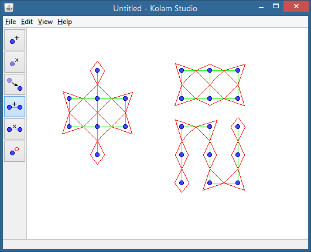

# Kolam Studio

*A few sample kolams rendered in Kolam Studio.*

Kolam Studio implements a system for describing kolams as planar graphs.

Right now the kolams are drawn with line segments, not smooth curves.

## Kolams

Kolams are Indian drawings of closed curves around a grid of dots. They are
drawn in colored powder on the ground to bring prosperity to the home.

## Kolams as graphs

While drawing kolams on paper, I realized that they could be described as planar
graphs. The curves around dots correspond to edges connecting the dots in a
graph. With this system, arbitrary graphs can be rendered as kolams, not just
rectangular grids.

This program can generate rectangular or triangular grids of points, and allows
the user to place points arbitrarily.

I found later that my graph system was not original. The paper ["Fundamental
Study on Design System of Kolam Pattern"](http://www.scipress.org/journals/forma/pdf/2201/22010031.pdf)
(Kiwamu Yanagisawa and Shojiro Nagata, 2007) analyzes them the same way,
although it focuses on the traditional rectangular grid patterns of kolams.